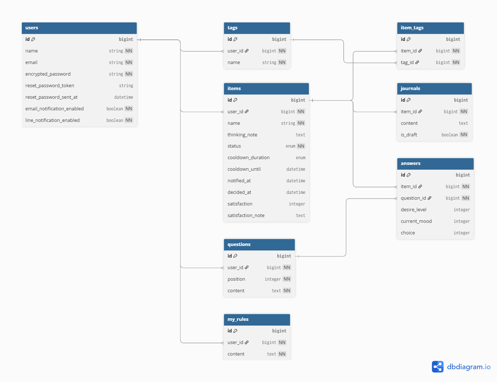

## サービス概要
  買う前に一度立ち止まり、「なぜ今買うのか？」を考える時間をつくることで、後悔しない購入判断をサポートするWebアプリです。質問への回答、クールダウンタイマー、ジャーナリングを通して、衝動的な購入を防ぎつつ、自分の気持ちや買う理由を整理することができます。

## 開発の背景
  私は以前、書籍や楽譜を買いすぎてしまったことがあります。一点一点は比較的安価だったため金額によるブレーキが効きづらく、まとめ買いを繰り返してしまいました。その結果、「本当に全てに手を付けられるのだろうか」という物を持ちすぎていることへの負担感を感じるようになりました。

  振り返ると、家計簿をつけるだけでは買いすぎを防ぐことはできず、「本当にいま買う必要があるのか」「ストレスによる衝動買いではないか」といった点を冷静に考える時間が必要だったと感じました。

  一方で、節約だけを重視すると、学び・経験・交流など本来使うべき場面にお金や時間を使えなくなる可能性もあるのではないかと考えました。

  そこで「買わない」ことを目的とするのではなく、購入判断をサポートすることで「後悔を減らす」ためのサービスを作ることにしました。

## 想定ユーザー
  - 衝動買いや無駄遣いを減らしたいと考えている方
  - 家計簿や節約アプリでは買いすぎを防げなかった方
  - 購入前に一度立ち止まって考える習慣を作りたい方

## サービスの利用イメージ
  1. 欲しいもの(買うか迷っているもの)を登録する
  2. 質問に回答し、現在の気分や欲しい理由を整理する
  3. クールダウンタイマーを設定し、購入判断を保留する
  4. タイマー終了後に通知を受け取る
  5. ジャーナリング(頭に浮かんだ感情や思考をありのまま書き出すこと)を行い、気持ちや考えを整理する
  6. 「買う」「買わない」を改めて判断する
  7. 判断結果を蓄積し、自分の思考パターンを振り返る

## サービスの特徴（既存サービス・競合調査）
  既存の衝動買い・無駄遣い防止サービスは、節約や支出管理を目的にしたものが多いです。
  - 金額を可視化するもの(例：家計簿、無駄遣い金額や節約金額を集計する)
  - 節約をサポートするもの(例：最安値を見つける)
  - 買わないことを目指すもの(例：我慢した回数を記録する、AIが購入の必要性を問いかける)

  一方、本サービスでは「なぜそれを欲しいと思ったのか」という思考整理と感情認識に焦点を当てています。感情を言語化・数値化すること(ラベリング)は衝動を抑え、ジャーナリングは自己理解の促進やストレス軽減に効果があるとされています。サービス利用の流れの中で、

  - 質問回答による感情のラベリング
  - クールダウンタイマー
  - ジャーナリング

  を組み合わせることで、衝動を落ち着かせた状態で購入判断ができる仕組みを提供します。 
  また、「買う」「買わない」どちらの判断も尊重した上で、ユーザーが納得して意思決定できる体験を大切にしたいと考えています。

## 機能候補
  ### MVPリリース
  - ユーザー登録・ログイン
  - 欲しいもの(買うか迷っているもの)登録
    - どのくらい欲しいか・今の気分(5段階で回答)
    - なぜ欲しいかを考えるきっかけになる質問(はい・わからない・いいえから選択式で回答)
    - ジャーナリング(頭に浮かんだ感情や思考をありのまま書き出すこと)
    - 購入判断(買う・買わない)
  - クールダウンタイマー(一定時間経過後にメール通知)
    - 「30分」「24時間」「3日」から選択 or スキップ
  - 判断履歴の表示

  ### 本リリース
  - ソーシャルログイン(OmniAuth)
  - 欲しいもの(買うか迷っているもの)登録の拡張
    - 質問内容のカスタマイズ(ユーザーが変更可能にする)
    - アイテムタグ(判断履歴の表示・購入傾向の分析に活用)
  - 通知機能の拡張
    - LINE通知(LINE Messaging API)
  - 登録済み情報の検索
  - 購入後の満足度登録(3段階で回答)
  - 購入傾向の分析(登録データを活用したグラフ表示)
  - 気づき・目標の登録(欲しいもの単体ではなく、購入判断全体に対するもの)

  ### 懸念点と対策
  #### ユーザーが入力や回答を面倒に感じ、継続できない可能性

  ジャーナリングは継続することで効果が出やすいとされていますが、毎回文章を書くことが負担になる可能性があります。

  **対策：**
  - 欲しいものの名前だけ先に登録できるようにする
  - 事前に選択式の質問を用意することで、ジャーナリングを行いやすくする
  - 時間がある時に落ち着いてジャーナリングを行えるようにする

  #### サービスの価値がユーザーに伝わりにくい可能性

  すぐに効果が実感できるサービスではないため、利用価値が伝わりにくい可能性があります。

  **対策：**
  - ユーザーのフィードバックを元に、サービス利用方法の伝え方や機能面を改善する
  - 購入傾向の分析機能を用意することで、ユーザーがより良い購入判断に繋げられるようにする

  ### 今後の展開・発展の方向性
  ジャーナリングの継続や、購入判断データの蓄積によって、以下のような価値を提供できると考えています。
  - ユーザーの自己理解の促進
  - 衝動買いしやすい状況や、思考・行動パターンの可視化

## 技術スタック（使用予定）
  | カテゴリ | 技術 |
  | --- | --- |
  | フロントエンド | Tailwind CSS, DaisyUI / Hotwire(Turbo/Stimulus) |
  | バックエンド | Ruby 3.3.x / Ruby on Rails 8.1.x |
  | データベース | PostgreSQL(Neon) |
  | デプロイ | Render |
  | その他 | devise / OmniAuth / RSpec / Capybara / RuboCop / kaminari / ransack / Solid Queue / Resend / LINE Messaging API |

  #### 選定理由
  短期間でMVPを開発し、ユーザーの反応をもとに改善を行うことを目的としているため、使用経験のある技術を中心に選定しました。Railsの標準機能やGemによって必要な機能を効率よく実装できると考えています。

  #### チャレンジしたい点・不安な点
  - Hotwire(Turbo/Stimulus)を活用した動的UIの実装
  - メール・LINE通知機能の実装
  - データを活用した分析機能の実装
  - デプロイを開発初期に行い、本番環境トラブルのリスク軽減
  - 通知機能や外部APIの実装経験が少なく、開発途中で課題が発生する可能性があるため、段階的な機能追加を意識

## 画面遷移図
https://www.figma.com/design/I13RiAe7Jm5zpk2mMcOQss/BuyZen?node-id=36-3027&p=f&t=6aR7NXQ9WivhPFJ3-0

## ER図
